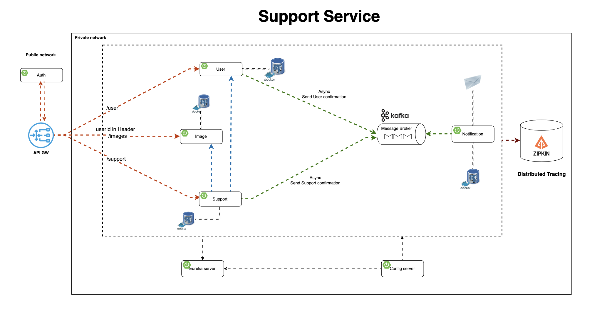
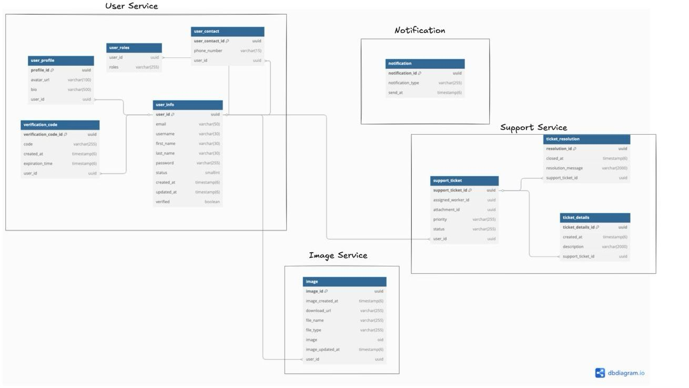

# Support Ticket System

## Overview

**Support Ticket System** is a microservices-based helpdesk and customer support platform designed to manage and track
user requests efficiently. The system is built using **Spring Boot, Spring Cloud, Kafka, and Redis** for a **scalable**,
**event-driven**, and **high-performance** solution.

## Architecture <a id="architecture"></a>

This project follows **microservices architecture** to ensure **scalability**, **resilience**, and **security**. Each
microservice is independently deployable and communicates via **event-driven messaging** (Kafka) and **RESTful APIs**.

### Microservices

- **Config Service**: Centralized configuration management for microservices.
- **Discovery Service (Eureka)**: Service registry for dynamic service discovery.
- **API Gateway (Spring Cloud Gateway)**: Routes client requests to the appropriate microservices and handles
  authentication.
- **Auth Service**: Handles authentication, authorization, and JWT token management.
- **User Service**: Manages user accounts, roles, and permissions.
- **Support Service**: Handles support ticket creation, tracking, and resolution.
- **Image Service**: Handles file uploads for support ticket attachments.

Each service operates **independently** and communicates using **Kafka** for **event-driven processing**.

---

## Technologies Used

- **Spring Boot 3.4.2** - Microservices framework
- **Spring Cloud** - Provides distributed system support
- **Kafka** - Message broker for event-driven architecture
- **PostgreSQL** - Relational database for support tickets and users
- **Redis** - Caching for fast access to frequently used data
- **Spring Security & JWT** - Authentication and authorization
- **Docker & Kubernetes** - Containerization and orchestration
- **Eureka** - Service discovery
- **Spring Cloud Config** - Centralized configuration management
- **Spring Cloud OpenFeign** - Inter-service communication

---

## How It Works

### 1. User Authentication

- Users authenticate through the **Auth Service** using **JWT tokens**.
- The API Gateway verifies each request and routes it to the corresponding service.

### 2. Support Ticket Creation

- A user submits a support ticket via the **Support Service**.
- The request is validated and stored in **PostgreSQL**.
- If an attachment is included, it is uploaded via the **Image Service**.

### 3. Kafka Event Processing

- The Support Service publishes an event to Kafka for ticket creation.
- Notification services (or worker services) can subscribe to updates and process them asynchronously.

### 4. Redis Caching

- Frequently accessed support tickets are cached in **Redis** to improve performance.

---

## Microservices Documentation

Each microservice has a dedicated README with detailed information:

- <a href="./services/config-server/README.md" target="_blank">**Config Service**</a>
- [**Config Service**](./services/config-server/README.md)
- [**Discovery Service**](./services/discovery/README.md)
- [**API Gateway**](./services/gateway/README.md)
- [**Auth Service**](./services/auth-service/README.md)
- [**User Service**](./services/user-service/README.md)
- [**Support Service**](./services/support-service/README.md)
- [**Image Service**](./services/image-service/README.md)

### System Architecture Diagrams <a id="architecture-diagrams"></a>

- [Microservices Architecture](#microservices-architecture)
- [Database Schema Design](#database-schema)

#### Microservices Architecture <a id="microservices-architecture"></a>

[](#architecture-diagrams)

#### Database Schema Design <a id="database-schema"></a>



---

## Running the Project

### Prerequisites

- **Java 17+**
- **Maven**
- **Docker**
- **Kafka & Zookeeper**
- **PostgreSQL**
- **Redis**

### Steps

### 1. Clone the repository

   ```sh
   git clone https://github.com/Fayupable/support-service.git
   cd support-service
   ```

### 2. Start Infrastructure Services


```sh
docker-compose up -d postgres mongodb redis zipkin zookeeper kafka mail-dev pgadmin mongo-express redis-commander
```

### 3. Build and Start Services

```sh
mvn clean package -DskipTests
docker-compose up -d config-server discovery user-service auth-service image-service support-service notification gateway
```

### Example Kafka Log

```
2025-02-25T14:45:10.123+03:00 INFO 12234 --- [support-service] [nio-8120-exec-1] c.f.kafka.SupportTicketProducer:
Publishing ticket created event: SupportTicketCreatedEvent(ticketId=45d3e2c4-8a3d-4871-ae5f-d2944f8a3c42, 
userId=550e8400-e29b-41d4-a716-446655440000, status=PENDING)
```

## API Documentation

**[View Full API Documentation](./services/API.md)**

## Monitoring & Debugging

### Monitor Services

```sh
docker logs -f <container_name>
```

### Monitor Kafka Topics

```sh
docker exec -it kafka kafka-console-consumer.sh --bootstrap-server kafka:9092 --topic support-tickets --from-beginning
```

## Contributions

Feel free to fork and contribute to this project! Create a pull request if you find any issues or want to add features.

## Contact

- Email: enisyaman4@gmail.com
- GitHub: Fayupable

## Acknowledgments

- Spring Boot & Spring Cloud
- Netflix OSS (Eureka, Feign, Gateway)
- Docker & Kubernetes
- Redis & Kafka
